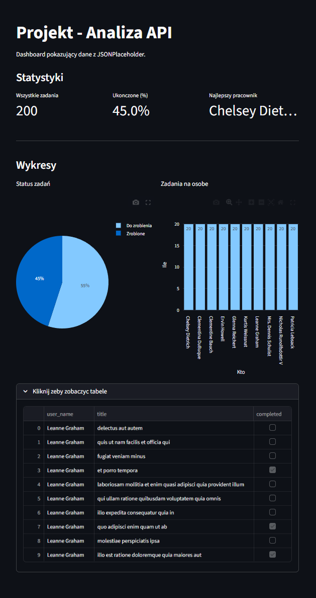

# Analiza API - Dashboard Streamlit

Prosty, interaktywny dashboard analityczny stworzony w Pythonie z wykorzystaniem biblioteki Streamlit. Aplikacja pobiera dane z publicznego API, łączy je i wyświetla na wykresach.

🌍 **https://xtklb6psvqtodmbemiyj57.streamlit.app**

## -Funkcjonalności-
* **Pobieranie danych:** Integracja z darmowym API JSONPlaceholder w celu pobrania listy użytkowników (`/users`) oraz ich zadań (`/todos`).
* **Przetwarzanie danych:** Użycie biblioteki pandas do zamiany JSON-ów na tabele (DataFrames) oraz ich połączenie (merge) po `userId`.
* **Statystyki:** Wyliczanie i wyświetlanie:
  * Całkowitej liczby zadań.
  * Procentu zadań ukończonych.
  * Lidera produktywności (osoby z największą liczbą zrobionych zadań).
* **Wizualizacje:** * Wykres kołowy pokazujący ogólny status zadań (Zrobione vs Do zrobienia).
  * Wykres słupkowy pokazujący liczbę zadań dla poszczególnych użytkowników.
* **Podgląd danych:** Możliwość rozwinięcia tabeli z surowymi danymi na dole strony.

## -Wykorzystanie AI-
Zgodnie z poleceniem w zadaniu, do pomocy przy tym projekcie wykorzystałem model językowy. ChatGPT pomógł mi w:
* Szybkim znalezieniu odpowiedniej funkcji w bibliotece pandas do łączenia dwóch tabel po wspólnym ID (`pd.merge`). 
* Zrozumieniu różnicy między uruchamianiem zwykłego skryptu Pythona a serwera Streamlit.
* Wyjaśnieniu relacji 'jeden do wielu' podczas łączenia tabel – dlaczego imiona użytkowników powtarzają się dla każdego ich zadania.

## -Wykorzystane technologie-
* Python 3.14
* Streamlit - interfejs użytkownika
* Pandas - transformacja i łączenie danych
* Requests - pobieranie danych (HTTP GET)
* Plotly Express - interaktywne wykresy

